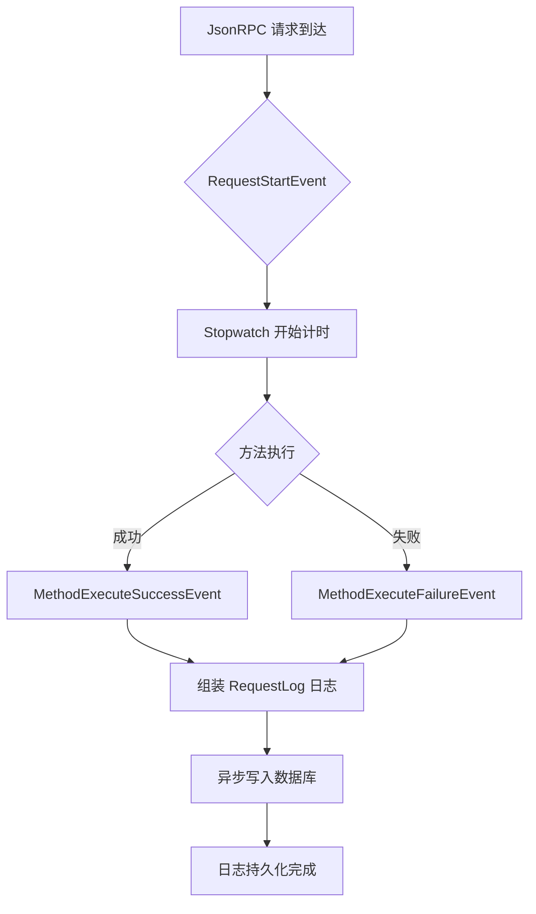

# JsonRPC Log 工作流程

以下为 JsonRPC 日志记录的核心流程说明及 Mermaid 流程图：

## 工作流程说明

1. JsonRPC 服务端收到请求，触发 `RequestStartEvent`，开始 Stopwatch 计时。
2. 方法执行成功时，触发 `MethodExecuteSuccessEvent`，记录请求、响应、耗时等信息。
3. 方法执行失败时，触发 `MethodExecuteFailureEvent`，记录请求、异常信息、耗时等。
4. 日志对象 `RequestLog` 通过 Doctrine 异步写入数据库。
5. 可通过事件 `JsonRpcLogFormatEvent` 自定义日志格式。

## Mermaid 流程图

